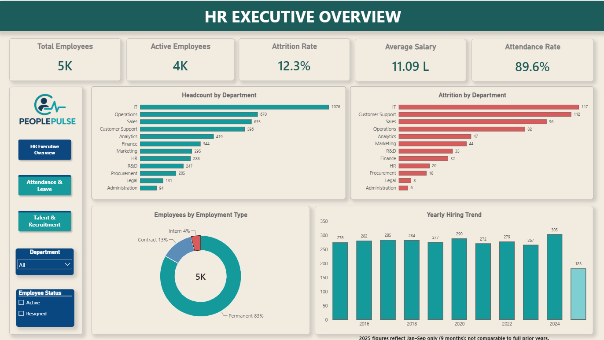
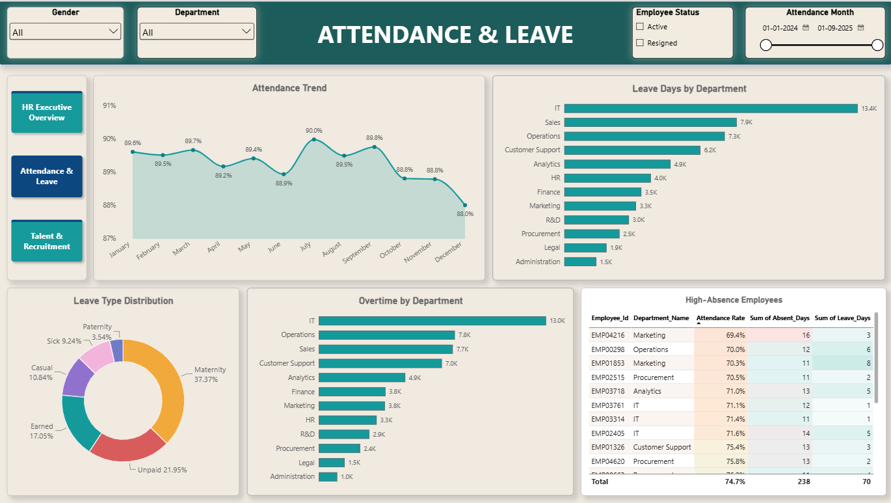
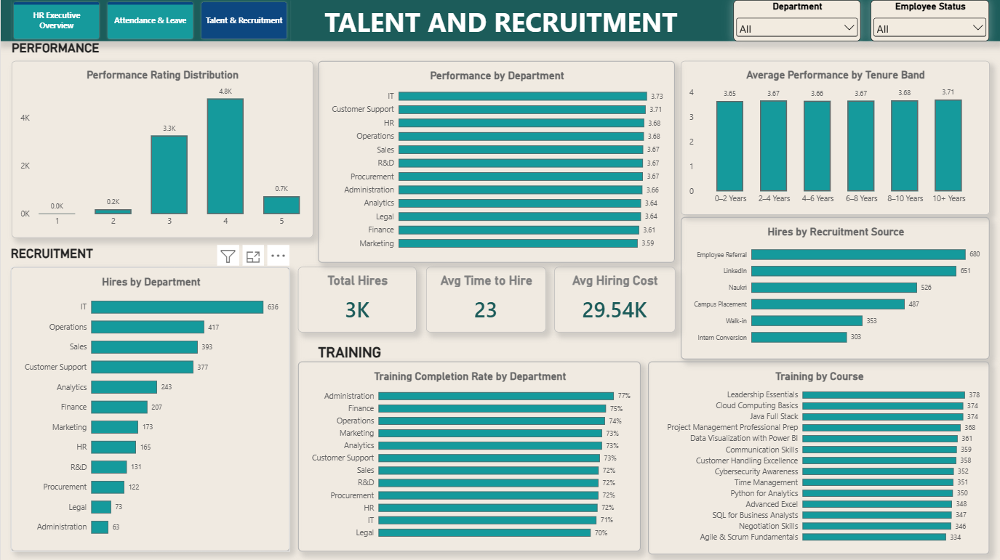

# PeoplePulse HR Analytics

## Project Overview

**PeoplePulse HR Analytics** is an HR analytics dashboard developed using **Power BI** to analyze employee workforce data and identify patterns related to employee attrition, salary, attendance, hiring, and tenure.

The project transforms employee-level HR data into interactive dashboards and KPIs to help HR stakeholders understand workforce trends and identify areas that may require attention.

---

## Objective

The objective of this project is to analyze key HR metrics and provide a clear view of:

- Workforce composition
- Employee attrition
- Attendance and absence
- Employee salary
- Employee tenure
- Hiring and recruitment patterns

The dashboard allows users to explore workforce metrics across different departments, employment types, and other relevant categories.

---

## Tools & Technologies

| Tool | Purpose |
|---|---|
| **Power BI** | Data modeling, DAX calculations, KPI development, dashboard creation, and data visualization |
| **Power Query** | Data cleaning and transformation |

---

## Data Cleaning & Transformation

Data cleaning and transformation were performed using **Power Query**.

The main transformation steps included:

- Merged the **First Name** and **Last Name** columns into a single **Name** column.
- Used **Replace Values** to standardize inconsistent values.
- Removed unnecessary columns that were not required for analysis.
- Applied **Trim** to remove unwanted leading and trailing spaces.
- Prepared the cleaned data for analysis and visualization in Power BI.

---

## Data Modeling & DAX

After cleaning and transforming the data in Power Query, the prepared data was loaded into **Power BI** for modeling and analysis.

DAX measures were created to calculate key HR metrics, including:

- Total Employees
- Active Employees
- Attrition Rate
- Average Salary
- Average Tenure
- Attendance Rate
- Absence Rate

These measures were used to create interactive KPIs and visualizations across the dashboard.

---

## Dashboard Pages

### 1. HR Executive Overview

Provides a high-level overview of the workforce using key HR KPIs and visualizations.

The page focuses on areas such as:

- Employee workforce overview
- Employee demographics
- Attrition
- Salary
- Tenure

### 2. Attendance and Leave

Analyzes employee attendance and absence patterns.

The page helps explore:

- Attendance rate
- Absence rate
- Leave-related patterns
- Department-level attendance trends

### 3. Talent and Recruitment

Provides insights into employee hiring and recruitment patterns.

The page focuses on:

- Hiring trends
- Recruitment sources
- Department-level hiring
- Recruitment-related metrics

---

## Key Insights

The dashboard analysis highlights several workforce patterns:

- The **IT department** shows comparatively higher employee attrition.
- **Contract employees** show higher attrition compared with permanent employees.
- **Marketing** shows comparatively lower attendance and higher absence patterns.
- The **IT department** has notable overtime-related costs.
- **Employee referrals** are an important source of hiring.
- Average employee tenure is approximately **6 years**.

These insights can help HR teams identify areas that may require further investigation and monitoring.

---

## Business Recommendations

Based on the analysis, the following areas could be considered by HR teams:

- Investigate factors contributing to higher attrition in the **IT department**.
- Analyze the reasons for higher attrition among **contract employees**.
- Review workload and overtime patterns in departments with higher overtime costs.
- Examine attendance and absence patterns in **Marketing**.
- Continue monitoring the effectiveness of **employee referrals** as a recruitment source.
- Regularly track workforce KPIs to identify changes in employee trends.

---

## Dashboard Preview

### HR Executive Overview



### Attendance and Leave



### Talent and Recruitment



---

## Project Structure

```text
PeoplePulse-HR-Analytics/
│
├── PowerBI/
│   └── PeoplePulse-HR-Analytics.pbix
│
└── Screenshots/
    ├── 01_HR_Executive_Overview.png
    ├── 02_Attendance_and_Leave.png
    └── 03_Talent_and_Recruitment.png
